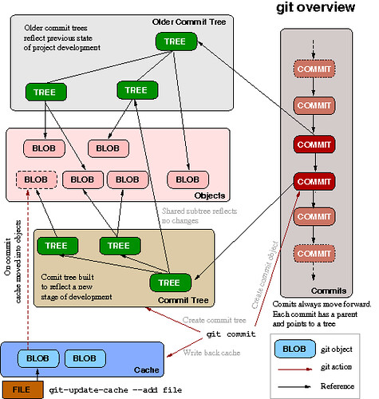

[< к содержанию](./readme.md)

##  Основы Git

***Git*** — это распределенная система контроля версий нашего кода. Зачем она нам? Для распределенных команд нужна какая-то система управления работы. Нужна, чтобы отслеживать изменения, которые происходят со временем. 

---

---
"Git 架构图" by Fenng(dbanotes) is licensed under CC BY-NC-SA 2.0. https://www.flickr.com/photos/99112767@N00/3340416618
